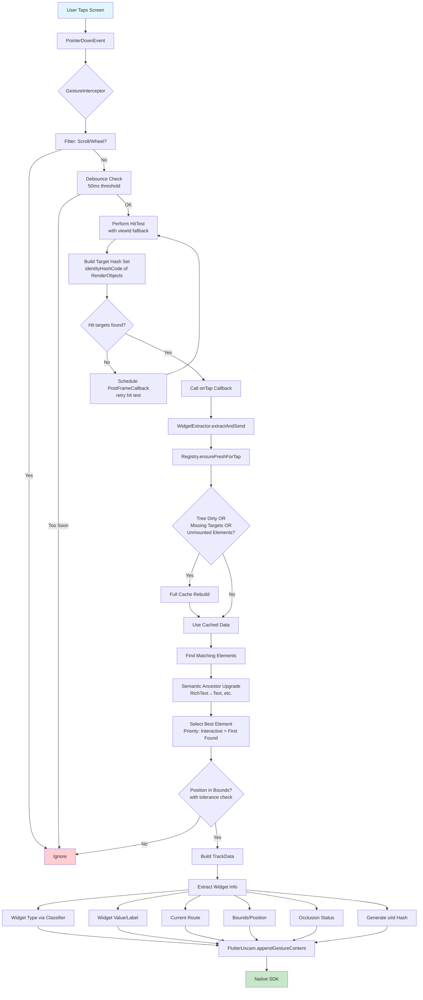

# Smart Events Architecture

This document explains the automatic smart events capture flow in the UXCam Flutter SDK. The architecture eliminates the need for wrapper widgets and automatically tracks user interactions across the entire app.

## Overview

Smart events are captured automatically when `startWithConfiguration()` is called. The system:

- Intercepts all tap gestures globally via Flutter's `GestureBinding.pointerRouter`
- Performs hit testing to identify tapped widgets (with fallback strategies)
- Classifies widgets by type (Button, TextField, Interactive, Text, Image, etc.)
- Upgrades implementation widgets to their semantic parents (e.g., RichText → Text)
- Extracts meaningful information (labels, values, routes)
- Generates unique UI identifiers for tracking
- Sends tracking data to the native SDK

## Architecture Components

```
┌─────────────────────────────────────────────────────────────────────────┐
│                         UXCamSmartEvents                                │
│                    (Main Coordinator / Singleton)                       │
├─────────────────────────────────────────────────────────────────────────┤
│  - Initializes all components via _UXCamBinding                         │
│  - Manages lifecycle (init, dispose, hot reload via generation counter) │
│  - Coordinates gesture tracking enable/disable                          │
│  - Provides NavigatorObserver for route tracking                        │
│  - Supports lazy route-tracking-only initialization                     │
│  - Handles memory pressure and app lifecycle                            │
└────────────────────┬────────────────────────────────────────────────────┘
                     │
      ┌──────────────┼──────────────┬──────────────┬──────────────┐
      ▼              ▼              ▼              ▼              ▼
┌───────────┐ ┌───────────┐ ┌───────────┐ ┌───────────┐ ┌───────────┐
│  Gesture  │ │  Element  │ │  Widget   │ │   Route   │ │  Widget   │
│Interceptor│ │  Registry │ │ Extractor │ │  Tracker  │ │ Classifier│
└───────────┘ └───────────┘ └───────────┘ └───────────┘ └───────────┘
```

### Core Components

| Component | File | Responsibility |
|-----------|------|----------------|
| `UXCamSmartEvents` | `uxcam_smart_events.dart` | Main coordinator, lifecycle management, hot reload support |
| `UXCamGestureInterceptor` | `uxcam_gesture_interceptor.dart` | Global tap interception via pointer router with fallback strategies |
| `UXCamElementRegistry` | `uxcam_element_registry.dart` | Element caching with WeakReference/Expando storage and RenderObject-to-Element mapping |
| `UXCamWidgetExtractor` | `uxcam_widget_extractor.dart` | Widget info extraction, semantic ancestor upgrading, and TrackData building |
| `UXCamRouteTracker` | `uxcam_route_tracker.dart` | Navigation route tracking (Navigator 1.0 & 2.0) with auto screen tagging |
| `UXCamWidgetClassifier` | `uxcam_widget_classifier.dart` | Widget type classification with obfuscation handling |

## Event Capture Flow



## Component Details

### 1. GestureInterceptor

**Purpose**: Captures all tap events globally without requiring wrapper widgets.

**How it works**:
1. Registers a global route handler with Flutter's `GestureBinding.pointerRouter`
2. Filters out scroll/wheel events (trackpad, middle mouse button)
3. Debounces rapid taps within 50ms to prevent duplicates
4. Performs hit testing at the tap position using `viewId` (with fallback to renderViews)
5. Builds a Set of `identityHashCode` values for all hit RenderBox objects
6. If no targets found, schedules a post-frame callback to retry
7. Passes position and target hashes to the WidgetExtractor

**Key behaviors**:
- Only processes `PointerDownEvent` (tap start)
- Uses bound handler reference for proper registration/removal
- Validates it's running on the main UI isolate

### 2. ElementRegistry

**Purpose**: Maintains a fast lookup cache mapping RenderObject hashes to Elements.

**How it works**:
1. Uses platform-appropriate storage:
   - **Native platforms**: `WeakReference<Element>` (auto-cleans when GC'd)
   - **Web**: Direct map with `element.mounted` checks
2. Stores `CachedElementInfo` containing widget type and display name
3. Rebuilds cache when:
   - Tree is marked dirty (route change, hot reload, app resume)
   - Hit targets are missing from cache
   - Cached elements are no longer mounted
4. Traverses element tree selectively, only caching recognized widget types
5. Prunes cache from 5000 to 3000 entries under memory pressure

**Cache invalidation triggers**:
- Route changes (via `onRouteChange()`)
- Hot reload (via `onHotReload()`)
- App resume (via `onAppResumed()`)
- `didPopRoute`, `didPushRoute`, `didPushRouteInformation` via WidgetsBindingObserver

### 3. WidgetClassifier

**Purpose**: Classifies widgets into trackable types using O(1) Set lookups.

**Widget Types**:
| Constant | Value | Description |
|----------|-------|-------------|
| `UX_UNKNOWN` | -1 | Unrecognized widget |
| `UX_CUSTOM` | 0 | Custom registered widget |
| `UX_BUTTON` | 1 | Buttons, tappable widgets |
| `UX_FIELD` | 2 | Text input fields |
| `UX_COMPOUND` | 3 | Interactive controls (Slider, Switch, etc.) |
| `UX_VIEWGROUP` | 5 | Containers (Scaffold, ListView, etc.) |
| `UX_TEXT` | 7 | Text widgets |
| `UX_IMAGE` | 12 | Image and icon widgets |
| `UX_DECOR` | 13 | DecoratedBox with decorations |

**Classification priority**:
1. Custom registered types (checked first)
2. Built-in Material button types
3. Built-in Cupertino button types
4. Field types
5. Interactive types
6. Text types
7. Image types
8. ViewGroup types
9. Special cases (DecoratedBox with image/shape, generic Radio<T>)

**Obfuscation handling**:
- Maintains a map of known type names
- Detects obfuscated names (short lowercase like "ab", "xyz")
- Falls back to generic names ("Button", "TextField", etc.)

### 4. WidgetExtractor

**Purpose**: Finds the best element to track and builds the final TrackData payload.

**Element selection process**:
1. Gets matching elements from registry for hit target hashes
2. Filters to only mounted elements with known types
3. Checks if tap position is within element bounds (with 10px tolerance)
4. **Semantic ancestor upgrade**: Walks up the element tree to find the highest same-type ancestor
   - Example: RichText → Text (Text has no RenderObject, delegates to RichText)
   - Example: GestureDetector → InkWell → ElevatedButton (returns ElevatedButton)
5. Deduplicates when multiple hit targets upgrade to the same ancestor
6. Selects best candidate: **Interactive types (Button, Field, Compound) take priority**

**TrackData fields**:
- `bounds`: Element's screen position and size
- `route`: Current navigation route
- `uiValue`: Extracted label/value (empty if occluded)
- `uiId`: Unique hash based on route + widget type + value
- `uiClass`: Widget type display name
- `uiType`: Widget type constant
- `isSensitive`: True if wrapped in OccludeWrapper

**Value extraction by type**:
- **Text**: Direct text content or TextSpan traversal
- **Image**: Image path, icon semantic label, or icon codepoint
- **Field**: Hint text or label text from decoration
- **Button**: Traverses children to find Text, RichText, or Icon with semantic label

### 5. RouteTracker

**Purpose**: Tracks current navigation route for associating events with screens.

**How it works**:
1. Creates `UXCamNavigatorObserver` instances for root and nested navigators
2. Maintains a stack of routes per NavigatorState
3. Determines route name through multiple strategies:
   - Explicit `route.settings.name`
   - Arguments map with 'screenName' key
   - Page settings (Navigator 2.0)
   - ValueKey from Page
   - Cleaned route type name as fallback

**Route name resolution priority**:
1. `ModalRoute.of(element).settings.name`
2. Route arguments map with 'screenName'
3. Page name (Navigator 2.0)
4. Page ValueKey value
5. Cleaned route type name
6. Observer-tracked route stack
7. Default: '/'

**Auto screen tagging**: Automatically calls `FlutterUxcam.tagScreenName()` on route changes.

**Popup detection**: `isPopupOnTop()` checks if a DialogRoute or ModalBottomSheetRoute is currently active.

## Data Flow Summary

```
┌─────────────┐     ┌──────────────┐     ┌─────────────┐
│   User Tap  │────▶│ HitTest Gets │────▶│ Registry    │
│             │     │ RenderObject │     │ Maps Hash   │
│             │     │ Hashes       │     │ to Element  │
└─────────────┘     └──────────────┘     └─────────────┘
      │                                         │
      │ (with viewId                            │ (WeakRef/Expando
      │  fallback)                              │  storage)
      ▼                                         ▼
┌─────────────┐     ┌──────────────┐     ┌─────────────┐
│ Build Target│     │ Classifier   │◀────│ Extractor   │
│ Hash Set    │     │ Gets Widget  │     │ Finds Best  │
│ (RenderBox) │     │ Type         │     │ Element     │
└─────────────┘     └──────────────┘     └─────────────┘
                           │                    │
                           │ (with obfuscation  │ (semantic
                           │  handling)         │  ancestor
                           ▼                    │  upgrade)
                    ┌──────────────┐            ▼
                    │ Extract      │     ┌─────────────┐
                    │ Value/Label  │◀────│ Build       │
                    │              │     │ TrackData   │
                    └──────────────┘     └─────────────┘
                                                │
                                                │ (+ uiId hash)
                                                ▼
                                         ┌─────────────┐
                                         │ Send to     │
                                         │ Native SDK  │
                                         └─────────────┘
```

## Performance Optimizations

1. **O(1) Type Classification**: Uses `Set.contains()` instead of linear searches
2. **Platform-Adaptive Caching**: Uses `WeakReference` on native platforms, mounted-check on web
3. **Dirty Flag Cache Management**: Tree marked dirty on route change, hot reload, or app resume - avoids time-based polling
4. **Full Rebuild on Miss**: Simpler strategy than incremental updates - rebuilds full tree when any target is missing or unmounted
5. **Debounced Tap Handling**: Rapid taps within 50ms are deduplicated
6. **Memory Pressure Handling**: Cache is pruned from 5000 to 3000 entries under memory pressure
7. **Bound Handler Reference**: Ensures proper registration/removal of global route handler
8. **Post-Frame Retry**: If hit test returns empty, retries after frame callback
9. **Semantic Ancestor Deduplication**: Prevents duplicate tracking when multiple RenderObjects upgrade to same semantic widget

## Hot Reload Support

The system handles hot reload gracefully:

1. `_UXCamBinding` extends `WidgetsFlutterBinding` and overrides `performReassemble()`
2. On hot reload, increments a generation counter
3. Cleans up all components (interceptor, extractor, tracker, registry)
4. Re-initializes with the same configuration if previously configured
5. Registry clears all caches and marks tree as dirty
